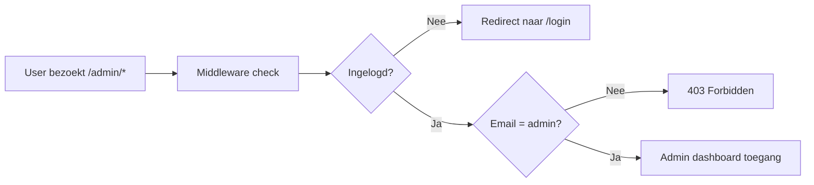

# EarthGuard Admin Dashboard Plan

## Doel
Een admin dashboard waarmee je alle content op de site dynamisch kunt beheren — zonder code te hoeven aanpassen. Events aanmaken, impact stats updaten, crowdfunding voortgang bijhouden, en meer.

## Huidige situatie
Veel content is **hardcoded** in de frontend components:

| Pagina/Component | Hardcoded content | Moet dynamisch |
|---|---|---|
| `community/page.tsx` | events, stories, harvest items, leaderboard, stats | ✅ Ja |
| `kaart/page.tsx` | projects array | ✅ Ja |
| `CrowdfundingProgress.tsx` | target=10000, current=0 | ✅ Ja |
| `ImpactTracker.tsx` | al Supabase `impact` tabel | ⚠️ Bestaat al |
| `dashboard/page.tsx` | staticUpdates array | ✅ Ja |

## Architectuur

```mermaid
flowchart TB
    subgraph Admin Dashboard
        A[/admin - Overzicht]
        B[/admin/events - Events]
        C[/admin/impact - Impact Stats]
        D[/admin/crowdfunding - Crowdfunding]
        E[/admin/projects - Projecten]
        F[/admin/newsletter - Nieuwsbrief]
        G[/admin/orders - Bestellingen]
        H[/admin/stories - Verhalen]
        I[/admin/harvest - Oogst]
        J[/admin/updates - Updates]
    end

    subgraph Supabase
        K[events table]
        L[impact table - exists]
        M[crowdfunding table]
        N[projects table]
        O[newsletter_subscribers - exists]
        P[orders - exists]
        Q[stories table]
        R[harvest_items table]
        S[updates table]
    end

    A --> K
    A --> L
    A --> M
    A --> O
    A --> P
    B --> K
    C --> L
    D --> M
    E --> N
    F --> O
    G --> P
    H --> Q
    I --> R
    J --> S

    subgraph Public Pages
        T[community - fetches events/stories/harvest]
        U[kaart - fetches projects]
        V[home - fetches impact/crowdfunding]
        W[dashboard - fetches updates]
    end

    K --> T
    Q --> T
    R --> T
    N --> U
    L --> V
    M --> V
    S --> W
```

## Nieuwe Supabase tabellen

### 1. `events`
```sql
CREATE TABLE events (
  id UUID DEFAULT gen_random_uuid() PRIMARY KEY,
  title TEXT NOT NULL,
  description TEXT NOT NULL,
  date TEXT NOT NULL,          -- "Binnenkort", "Elke zaterdag", of datum
  month TEXT DEFAULT '2025',   -- Weergave maand/jaar
  location TEXT NOT NULL,
  tag TEXT NOT NULL,            -- "Planten", "Dieren", "Feest", "Rondleiding"
  sort_order INTEGER DEFAULT 0,
  active BOOLEAN DEFAULT true,
  created_at TIMESTAMPTZ DEFAULT now()
);
```

### 2. `projects`
```sql
CREATE TABLE projects (
  id UUID DEFAULT gen_random_uuid() PRIMARY KEY,
  name TEXT NOT NULL,
  location TEXT NOT NULL,
  type TEXT NOT NULL,           -- "forest", "pond", etc.
  status TEXT NOT NULL,         -- "Opstart", "Gepland", "Actief"
  progress INTEGER DEFAULT 0,
  target INTEGER NOT NULL,
  current INTEGER DEFAULT 0,
  description TEXT NOT NULL,
  features TEXT[] DEFAULT '{}', -- Array van features
  sort_order INTEGER DEFAULT 0,
  active BOOLEAN DEFAULT true,
  created_at TIMESTAMPTZ DEFAULT now()
);
```

### 3. `stories`
```sql
CREATE TABLE stories (
  id UUID DEFAULT gen_random_uuid() PRIMARY KEY,
  name TEXT NOT NULL,
  quote TEXT NOT NULL,
  role TEXT NOT NULL,
  initials TEXT NOT NULL,
  sort_order INTEGER DEFAULT 0,
  active BOOLEAN DEFAULT true,
  created_at TIMESTAMPTZ DEFAULT now()
);
```

### 4. `harvest_items`
```sql
CREATE TABLE harvest_items (
  id UUID DEFAULT gen_random_uuid() PRIMARY KEY,
  name TEXT NOT NULL,
  description TEXT NOT NULL,
  available TEXT NOT NULL,      -- "Jaarlijks", "Lente t/m Herfst", etc.
  icon TEXT NOT NULL,           -- "Egg", "Carrot", "Apple"
  color TEXT NOT NULL,          -- "bg-amber-100 text-amber-700", etc.
  sort_order INTEGER DEFAULT 0,
  active BOOLEAN DEFAULT true,
  created_at TIMESTAMPTZ DEFAULT now()
);
```

### 5. `updates`
```sql
CREATE TABLE updates (
  id UUID DEFAULT gen_random_uuid() PRIMARY KEY,
  title TEXT NOT NULL,
  description TEXT NOT NULL,
  icon TEXT NOT NULL,           -- "Trees", "Squirrel", "ArrowUpRight", etc.
  color TEXT NOT NULL,          -- "bg-green-100 text-green-600", etc.
  sort_order INTEGER DEFAULT 0,
  active BOOLEAN DEFAULT true,
  created_at TIMESTAMPTZ DEFAULT now()
);
```

### 6. `crowdfunding`
```sql
CREATE TABLE crowdfunding (
  id UUID DEFAULT gen_random_uuid() PRIMARY KEY,
  project_name TEXT NOT NULL,
  target INTEGER NOT NULL,
  current INTEGER DEFAULT 0,
  updated_at TIMESTAMPTZ DEFAULT now()
);
```

### 7. `community_stats`
```sql
CREATE TABLE community_stats (
  id UUID DEFAULT gen_random_uuid() PRIMARY KEY,
  label TEXT NOT NULL,
  value TEXT NOT NULL,
  icon TEXT NOT NULL,           -- "Users", "Leaf", "Calendar", "Heart"
  color TEXT NOT NULL,
  sort_order INTEGER DEFAULT 0,
  updated_at TIMESTAMPTZ DEFAULT now()
);
```

## Admin Dashboard Paginas

### `/admin` — Overzicht
- Totaal bestellingen en omzet
- Totaal nieuwsbrief abonnees
- Totaal m2 geadopteerd
- Crowdfunding voortgang
- Laatste 5 bestellingen
- Laatste 5 nieuwsbrief inschrijvingen

### `/admin/events` — Events beheren
- Lijst van alle events
- Nieuw event aanmaken
- Event bewerken
- Event activeren/deactiveren
- Sorteren

### `/admin/impact` — Impact stats bewerken
- Formulier om m2, bomen, CO2, dieren aan te passen
- Direct zichtbaar op homepage

### `/admin/crowdfunding` — Crowdfunding bijhouden
- Target en current bedrag aanpassen
- Voortgangsbalk op homepage update automatisch

### `/admin/projects` — Projecten beheren
- Lijst van projecten
- Nieuw project aanmaken
- Project bewerken
- Status aanpassen
- Features toevoegen

### `/admin/newsletter` — Nieuwsbrief abonnees
- Lijst van alle ingeschreven emails
- Aantal abonnees
- Export mogelijkheid

### `/admin/orders` — Bestellingen
- Lijst van alle bestellingen
- Filter op status
- Totaal omzet

### `/admin/stories` — Verhalen/testimonials
- Lijst van verhalen
- Nieuw verhaal toevoegen
- Bewerken/verwijderen

### `/admin/harvest` — Oogst items
- Lijst van oogst items
- Nieuw item toevoegen
- Bewerken/verwijderen

### `/admin/updates` — Updates/nieuws
- Lijst van updates
- Nieuwe update toevoegen
- Bewerken/verwijderen
- Verschijnen op user dashboard

## Admin Authenticatie

Eenvoudige aanpak: middleware check of de ingelogde user email overeenkomt met een admin email. Geen aparte rol nodig in Supabase.



## Implementatie volgorde

1. Supabase migratie - alle tabellen aanmaken
2. Seed data - hardcoded content migreren naar Supabase
3. Admin layout + navigatie
4. Admin auth middleware
5. Admin overzicht pagina
6. Events CRUD
7. Impact stats editor
8. Crowdfunding editor
9. Projects CRUD
10. Newsletter subscribers viewer
11. Orders viewer
12. Stories CRUD
13. Harvest items CRUD
14. Updates CRUD
15. Frontend pages updaten - fetch van Supabase
16. Testen en deployen
